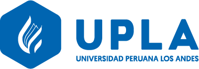

# 🎓 Taller de Desarrollo de Aplicaciones I y II

¡Bienvenido a mi repositorio del curso **Taller de Desarrollo de Aplicaciones I y II**!  
Este repositorio contiene todo el material desarrollado a lo largo de ambos cursos, incluyendo prácticas, guías, proyectos, talleres y apuntes.

---

## 👤 Información Personal

- **Nombre:** Romero Rojas Adriano Alessandro  
- **Código:** Q01171J  
- **Universidad:** Universidad Peruana Los Andes  

---

## 📁 Estructura del Repositorio

Este repositorio se divide en dos secciones principales.  
Haz clic en la que quieras explorar:

### 🔹 [👉 Ir a Desarrollo de Aplicaciones I](./Desarrollo-Aplicaciones-I)

> En esta sección encontrarás los trabajos del curso **Desarrollo de Aplicaciones I**, donde se trabajó principalmente con interfaces gráficas en Java usando NetBeans.

---

### 🔹 [👉 Ir a Desarrollo de Aplicaciones II](./Desarrollo-Aplicaciones-II)

> En esta sección encontrarás los materiales del curso **Desarrollo de Aplicaciones II**, enfocado en el desarrollo de aplicaciones web.

> 📌 Cada carpeta contiene su propio `README.md` con detalles sobre el contenido específico, tecnologías utilizadas y organización interna.

---

## 🙌 Gracias por visitar mi repositorio

> Siéntete libre de explorar, comentar o sugerir mejoras.  
¡Vamos a seguir aprendiendo juntos! 🚀
