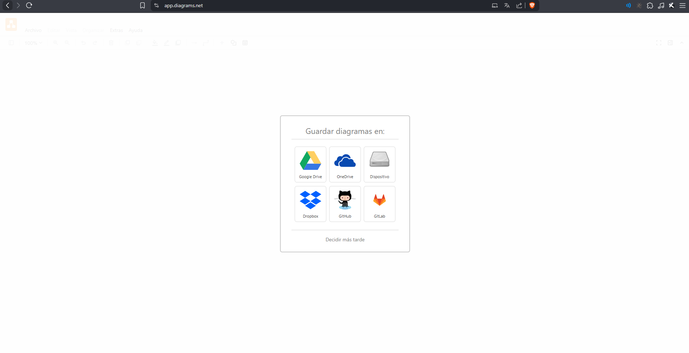
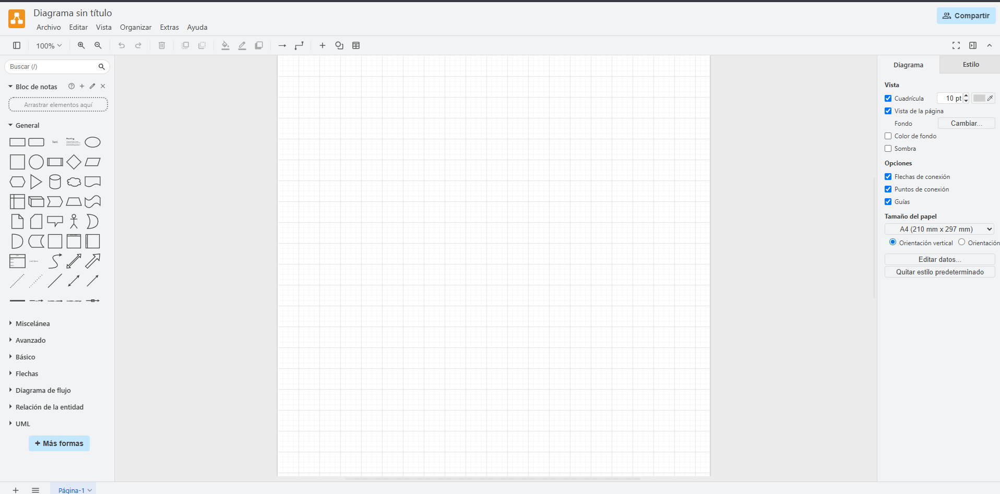
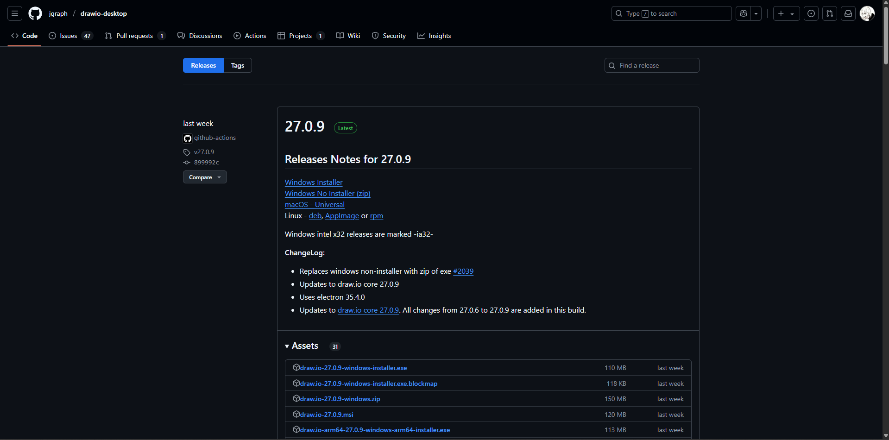
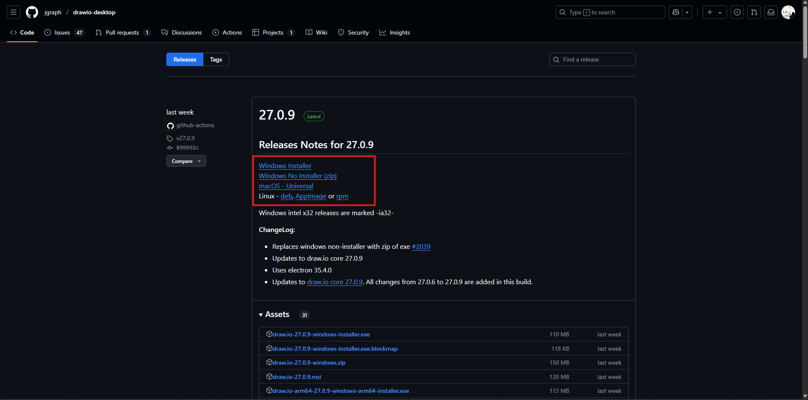
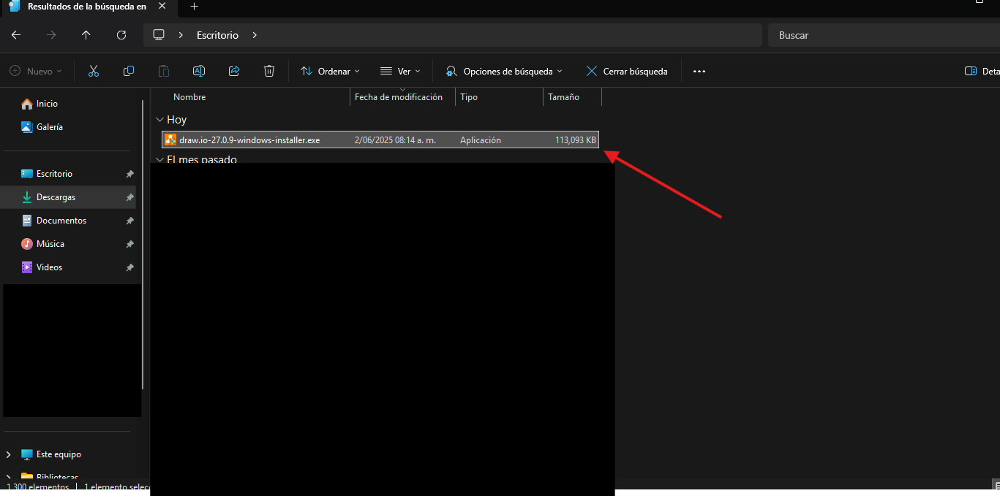
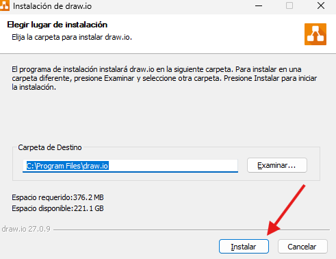
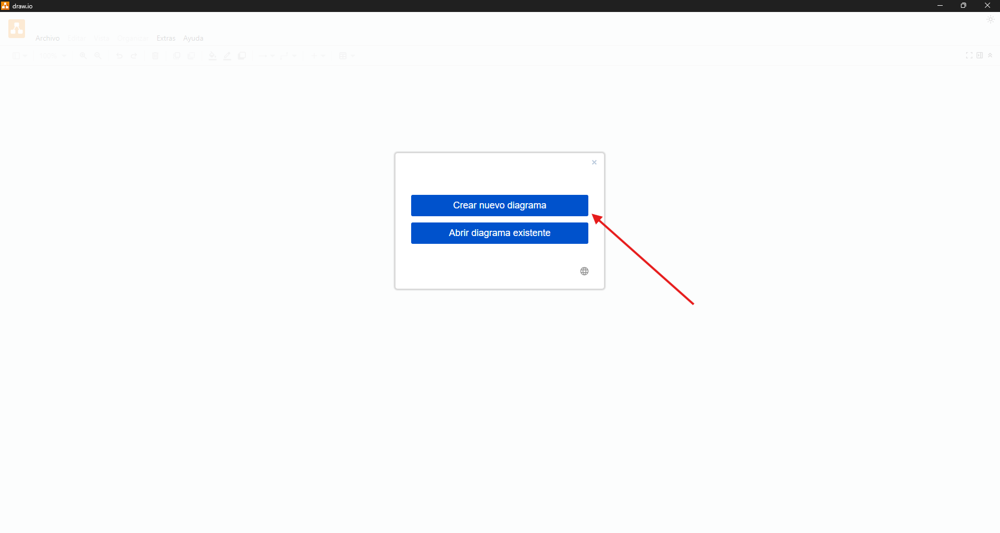
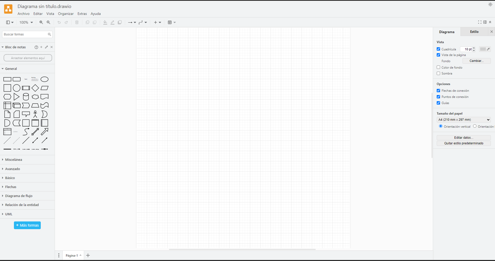

# 📊 Guía de Instalación de Draw.io (diagrams.net)

**Draw.io** (actualmente conocido como [**diagrams.net**](https://www.diagrams.net/)) es una herramienta gratuita que permite crear **diagramas visuales** como:

- Diagramas de clases UML  
- Diagramas de flujo  
- Diagramas entidad-relación (ER)  
- Arquitectura de sistemas  
- Esquemáticos de base de datos  
- Mapas mentales y más  

---

## 🎯 ¿Para qué lo usamos?

En el curso **Taller de Desarrollo de Aplicaciones I y II**, utilizaremos **Draw.io** principalmente para:

- 📌 **Crear diagramas UML** que representen la estructura y lógica de nuestras aplicaciones.
- 🧩 **Explicar visualmente** los sistemas desarrollados (como flujo de pantallas, lógica de negocio, módulos, etc.).
- 🔍 **Documentar nuestros proyectos** de forma clara y profesional para facilitar su comprensión.

---

## 🛠️ Cómo instalar Draw.io en tu PC

Puedes utilizar Draw.io **de dos maneras**: directamente en línea o instalándolo en tu computadora.

---

### ✅ Opción 1: Usar Draw.io en línea (recomendado si no deseas instalar nada)

1. Accede a 👉 [https://app.diagrams.net/](https://app.diagrams.net/) 🌐.

2. Selecciona la opción **Decidir más tarde**.

3. ¡Listo! Ya puedes comenzar a crear tus diagramas.

---

### 💻 Opción 2: Instalar Draw.io en Windows

1. Ingresa a la página oficial de descargas desde GitHub:  
   👉 [https://github.com/jgraph/drawio-desktop/releases](https://github.com/jgraph/drawio-desktop/releases) 🌐

2. Selecciona tu sistema operativo desde la lista de opciones disponibles.

3. Ubica el archivo descargado y haz doble clic para iniciar la instalación.

4. Si se solicita permiso para realizar cambios, haz clic en **Sí**. Luego selecciona **Instalar** para comenzar la instalación.

5. Una vez instalado, abre el programa y selecciona **Crear nuevo diagrama**.

6. Comienza a trabajar en tus diagramas.

---

## 🧠 Consejos para usarlo

- Guarda tus archivos con extensión `.drawio` o `.xml` para poder editarlos posteriormente.
- Puedes exportar tus diagramas como imagen (`.png`, `.jpg`) o en formato PDF.
- Utiliza las plantillas UML que ya están disponibles en la aplicación para ahorrar tiempo y mantener una estructura profesional.

---

## 📂 Archivos sugeridos en esta carpeta

- `Ejemplo-UML.drawio` → Diagrama de clases UML como ejemplo.
- `Manual-basico-Drawio.pdf` → Guía resumida para crear y exportar diagramas.
- `Plantillas` → Carpeta con diagramas base reutilizables.

---

## ✅ ¡Listo!

Ahora cuentas con una herramienta potente y gratuita para crear diagramas claros y profesionales.  
**Draw.io** te ayudará a representar gráficamente tus ideas, estructurar tus sistemas y documentar tus proyectos de forma visual y efectiva. 