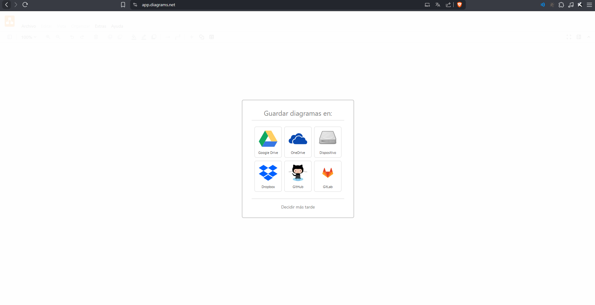
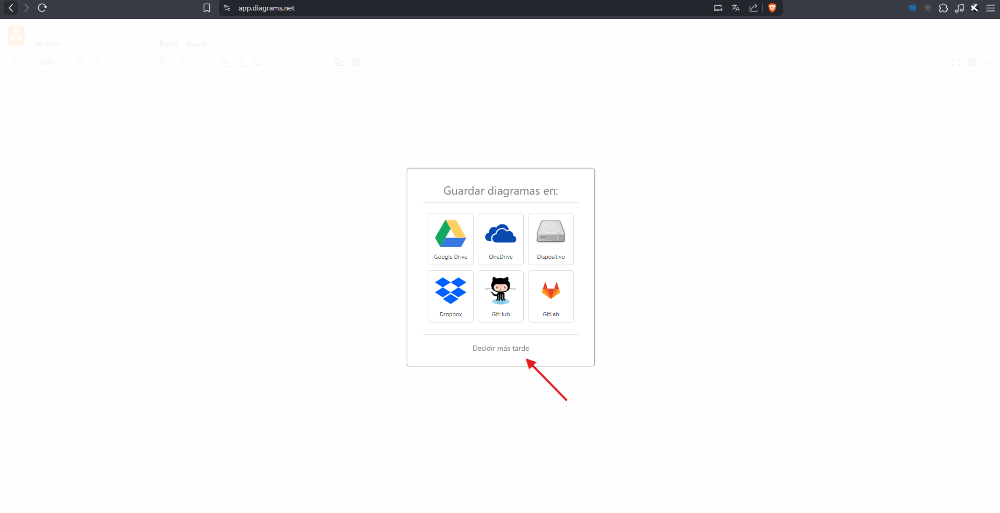
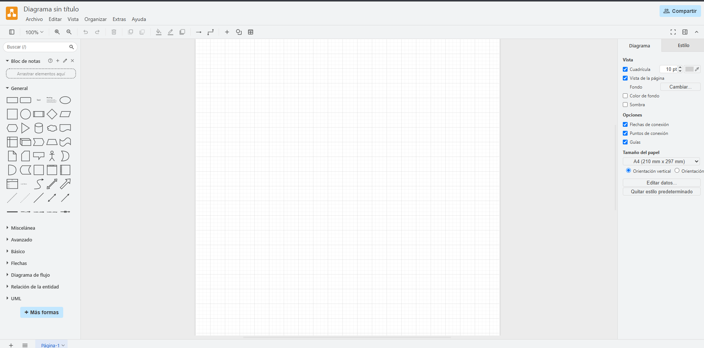

# 📊 Guía de Instalación de Draw.io (diagrams.net)

**Draw.io** (actualmente conocido como [**diagrams.net**](https://www.diagrams.net/)) es una herramienta gratuita para crear **diagramas visuales** como:

- Diagramas de clases UML
- Diagramas de flujo
- Diagramas entidad-relación (ER)
- Arquitectura de sistemas
- Esquemáticos de base de datos
- Mapas mentales y más

---

## 🎯 ¿Para qué lo usamos?

En el contexto del curso **Taller de Desarrollo de Aplicaciones I y II**, utilizaremos **Draw.io** principalmente para:

- 📌 **Crear diagramas UML** que representen la estructura y lógica de nuestras aplicaciones.
- 🧩 **Explicar visualmente** los sistemas que desarrollamos (como el flujo de pantallas, lógica de negocio, etc.).
- 🔍 **Documentar los proyectos** con una vista clara y comprensible para profesores, compañeros y revisores.

---

## 🛠️ Cómo instalar Draw.io en tu PC

Puedes usar Draw.io **de dos formas**: en línea o instalado en tu computadora.

### ✅ Opción 1: Usar Draw.io en línea (recomendado si no quieres instalar nada)

1. Ve a 👉 [https://app.diagrams.net/](https://app.diagrams.net/) 🌐.

2. Seleccione **Decidir mas tarde**.

3. ¡Listo! Ya puedes comenzar a crear tus diagramas.

---

### 💻 Opción 2: Instalar Draw.io en Windows

1. Accede a la página oficial de descargas:
   👉 [https://github.com/jgraph/drawio-desktop/releases](https://github.com/jgraph/drawio-desktop/releases) 🌐

2. Busca la última versión estable y descarga el archivo `.exe` correspondiente a tu sistema operativo.  
   📌 Ejemplo: `draw.io-setup-x64.exe`

3. Ejecuta el archivo descargado e instala el programa.

4. Una vez instalado, abre el programa y selecciona una carpeta local para guardar tus diagramas.

---

## 🧠 Consejos para usarlo

- Guarda tus archivos con la extensión `.drawio` o `.xml` para poder editarlos después.
- Puedes exportar tus diagramas como imágenes (`.png`, `.jpg`) o PDF.
- Usa las plantillas UML que ya vienen incluidas para ahorrar tiempo.

---

## 📂 Archivos sugeridos en esta carpeta

- `Ejemplo-UML.drawio` → Diagrama de clases UML como ejemplo.
- `Manual-basico-Drawio.pdf` → Instrucciones resumidas para crear y exportar diagramas.
- `Plantillas` → Carpeta con diagramas base para editar y reutilizar.

---

## ✅ ¡Listo!

Ahora tienes una herramienta potente para crear diagramas claros y profesionales para tus proyectos.  
Usar Draw.io te ayudará a **documentar mejor tus ideas** y a **comunicarte visualmente** con tu equipo y docentes.

