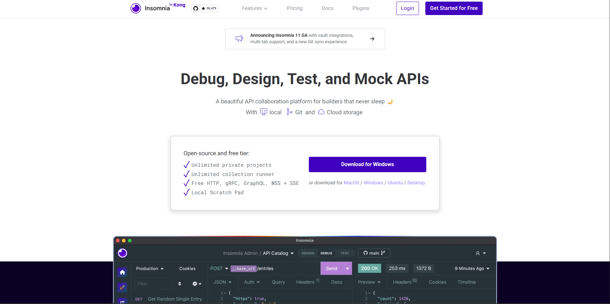
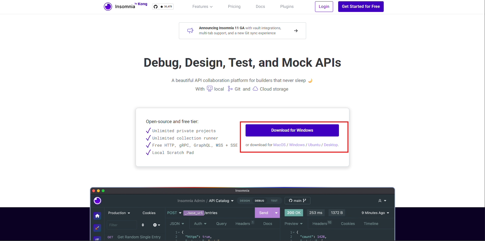
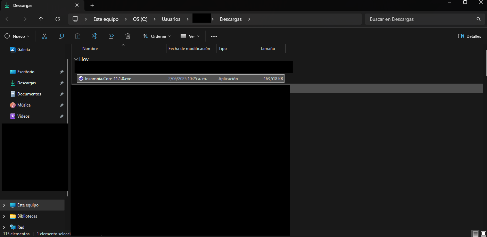

# 🌐 Guía de Instalación de Insomnia REST Client

**Insomnia** es una herramienta de código abierto diseñada para probar y documentar **APIs REST**, GraphQL y otros servicios web.  
Permite enviar solicitudes HTTP como `GET`, `POST`, `PUT`, `DELETE`, entre otras, de manera sencilla y visual.

---

## 🎯 ¿Para qué lo usamos?

En el curso **Taller de Desarrollo de Aplicaciones II**, utilizaremos **Insomnia** principalmente para:

- ✅ **Probar nuestras APIs creadas con Java Spring Boot**.
- 🔗 Simular peticiones y respuestas HTTP sin necesidad de una interfaz gráfica.
- 🧪 Verificar que los endpoints funcionen correctamente (envío, edición, borrado, etc.).
- 📤 Enviar datos en formato `JSON` y recibir respuestas del servidor.
- 🛠️ Realizar pruebas de autenticación, headers, tokens, etc.

---

## 💻 ¿Cómo instalar Insomnia?

### ✅ Paso 1: Acceder a la página oficial

1. Ingresa a 👉 [https://insomnia.rest/](https://insomnia.rest/) 🌐  
*(usa Ctrl + clic para abrir en nueva pestaña)*

---

### ✅ Paso 2: Seleccionar tu sistema operativo

2. El sitio detectará automáticamente tu sistema operativo.  
Haz clic en el botón correspondiente (Windows, macOS o Linux).

---

### ✅ Paso 3: Instalar Insomnia

3. Abre el archivo descargado e instala la aplicación.

📌 En Windows, da doble clic al instalador `.exe` y sigue los pasos habituales.

---

### ✅ Paso 4: Abrir Insomnia

4. Inicia la aplicación desde el menú de inicio o desde el acceso directo del escritorio.

---

## 🧠 Consejos para usarlo con Java Spring Boot

- Crea **colecciones** por proyecto y agrupa las peticiones según el módulo o entidad (`/usuarios`, `/productos`, etc.).
- Asegúrate de que tu servidor local (`localhost:8080`) esté corriendo antes de enviar peticiones.
- Usa el formato `application/json` en el body para enviar objetos correctamente.
- Puedes añadir **token JWT** o autenticación básica según la configuración de tu API.

---

## 📂 Archivos sugeridos en esta carpeta

- `Proyecto-API-Spring-Demo.json` → Colección de ejemplo exportada con endpoints comunes.
- `Guía-Básica-Insomnia.pdf` → Manual resumido para probar APIs Spring paso a paso.

---

## ✅ ¡Listo!

Ahora puedes probar, depurar y validar el comportamiento de tus APIs creadas en Java con Spring Boot  
de forma clara, rápida y profesional usando **Insomnia**. ¡Es una herramienta clave para cualquier backend developer! 🚀
