# 🧠 Guía para Obtener la Licencia Gratuita de JetBrains para Estudiantes

**JetBrains** ofrece herramientas profesionales para desarrolladores como IntelliJ IDEA, PyCharm, WebStorm, PhpStorm, entre otras.  
Gracias al convenio educativo con GitHub, puedes acceder a todas estas herramientas de forma **completamente gratuita** como estudiante.

---

## 🎓 Activación a través de GitHub Education

Para obtener la licencia de JetBrains como estudiante, **primero necesitas activar tu GitHub Student Developer Pack**.

👉 [Haz clic aquí para ver cómo obtener GitHub Education](../Obtener-Github-Education/) 🌐  
*(usa Ctrl + clic para abrir en nueva pestaña)*

Una vez que tengas GitHub Education aprobado, podrás acceder a JetBrains desde el panel de beneficios.

---

## 💻 ¿Qué herramientas incluye la licencia?

Con tu cuenta de estudiante aprobada, puedes usar:

- ✅ **IntelliJ IDEA Ultimate** – Desarrollo en Java, Kotlin, Android, etc.
- ✅ **PyCharm Professional** – Python, ciencia de datos, Django, etc.
- ✅ **WebStorm** – JavaScript, React, Vue, Node.js.
- ✅ **PhpStorm**, **CLion**, **DataGrip**, **Rider**, **RubyMine**, **GoLand**, y más.

Todas las herramientas están disponibles para **Windows, macOS y Linux**.

---

## 🛠️ Pasos para activar tu licencia con JetBrains

### 1️⃣ Acceder desde el JetBrains Student Pack

1. Dirígete a 👉 [https://www.jetbrains.com/es-es/academy/student-pack/](https://www.jetbrains.com/es-es/academy/student-pack/) 🌐

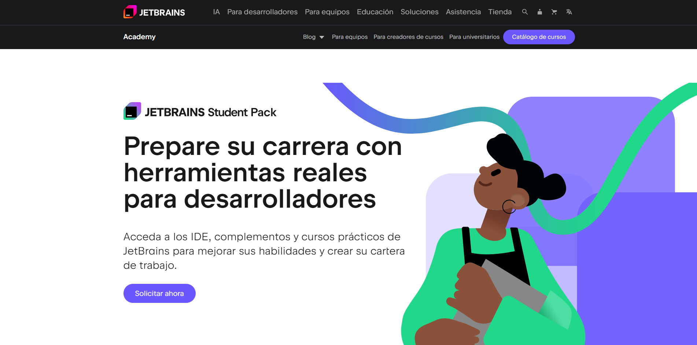

2. Haz clic en **Solicitar ahora**.

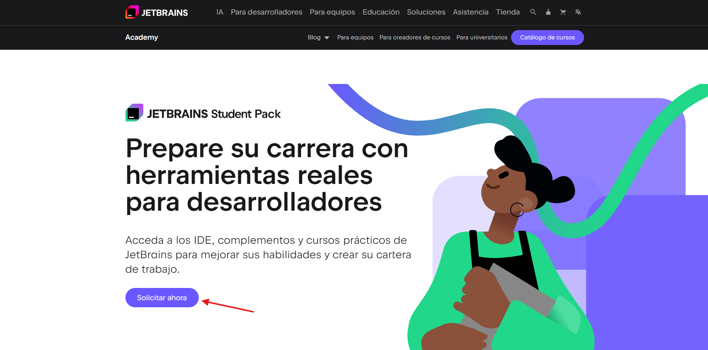

3. Serás redirigido a una verificación de seguridad. Haz clic en **Comenzar**.

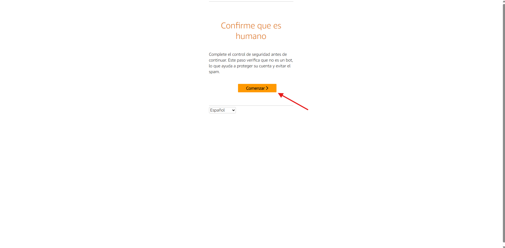

4. Completa el desafío de verificación (puede variar) y haz clic en **Confirmar**.

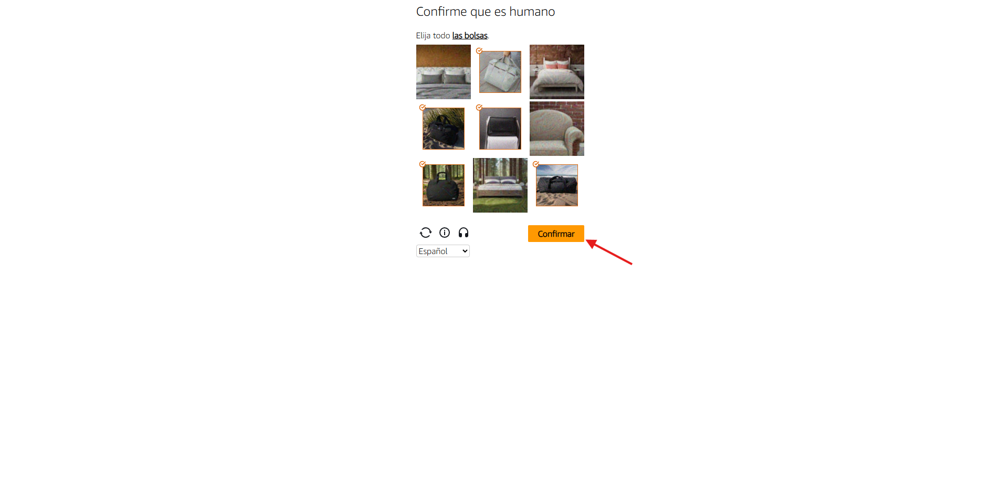

5. Una vez confirmado, aparecerá un mensaje de validación. Espera a que el sistema te redirija automáticamente.

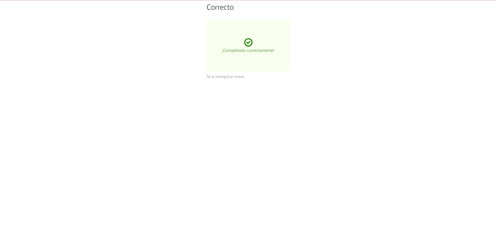

6. Luego, accede a la pestaña **GitHub**.

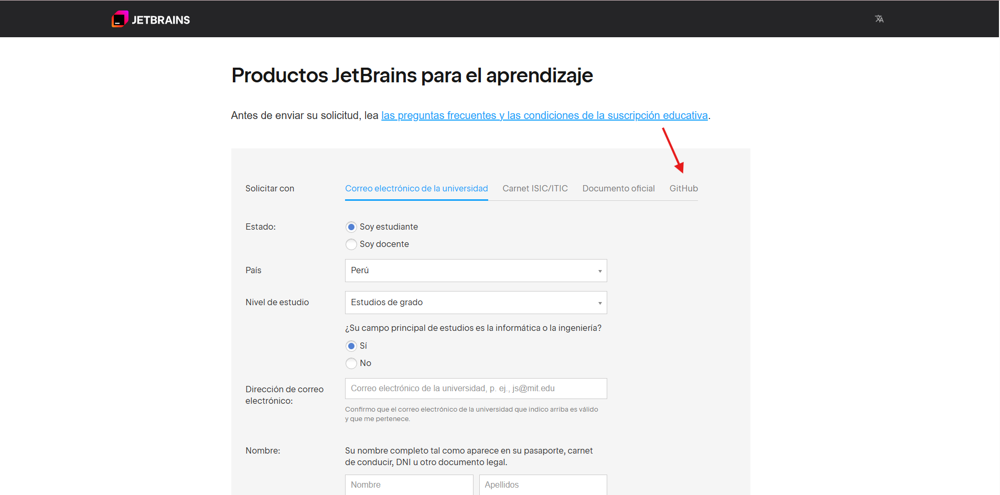

7. Haz clic en el botón **Autorizar con GitHub**.

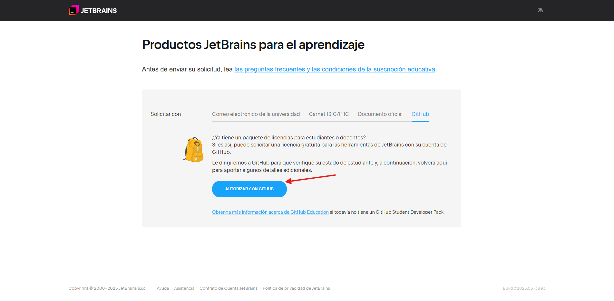

8. Se volverá a mostrar un desafío para confirmar que eres humano. Haz clic en **Comenzar**.

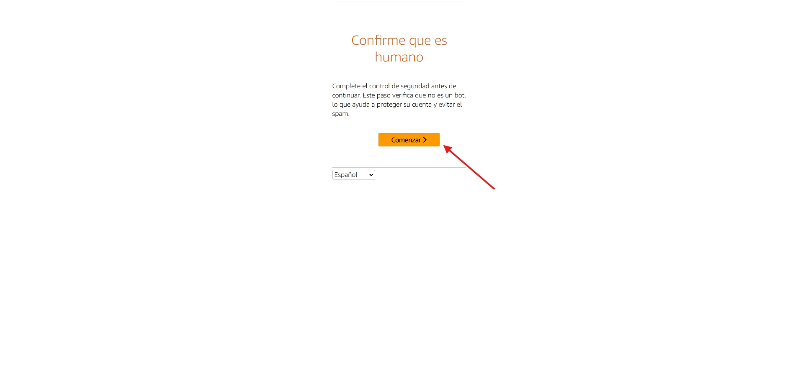

9. Realiza la verificación solicitada y luego haz clic en **Confirmar**.

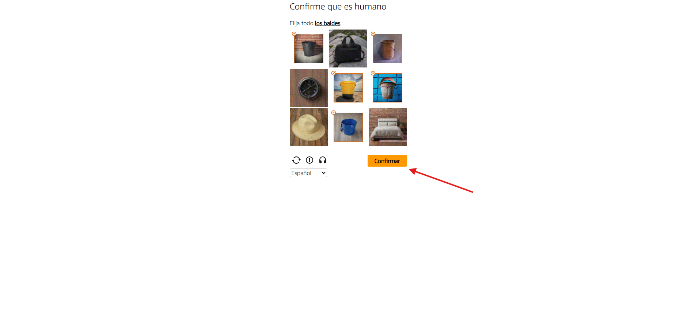

10. Espera a ser redirigido automáticamente a JetBrains.

11. Haz clic en **Authorize JetBrains** para vincular tu cuenta de GitHub.

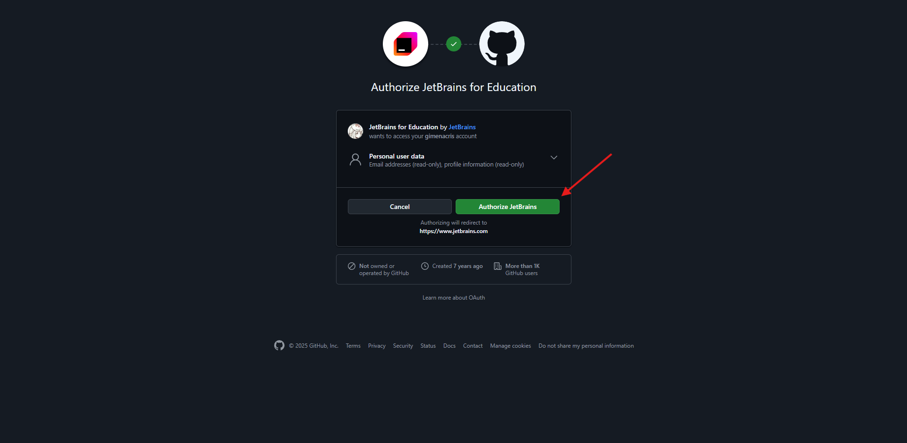

12. Espera a que la redirección finalice.

13. Rellena los campos faltantes en el formulario y haz clic en **Solicitar productos gratuitos**.

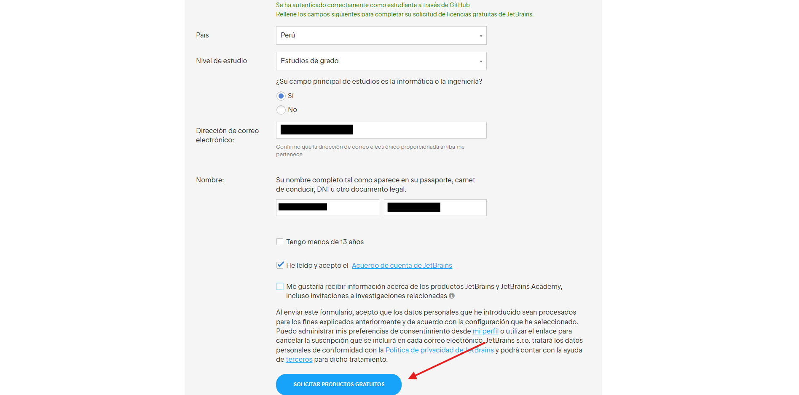

14. Vuelve a confirmar que eres humano.

15. Luego de completar la verificación, verás un mensaje indicando que las instrucciones han sido enviadas a tu correo institucional.

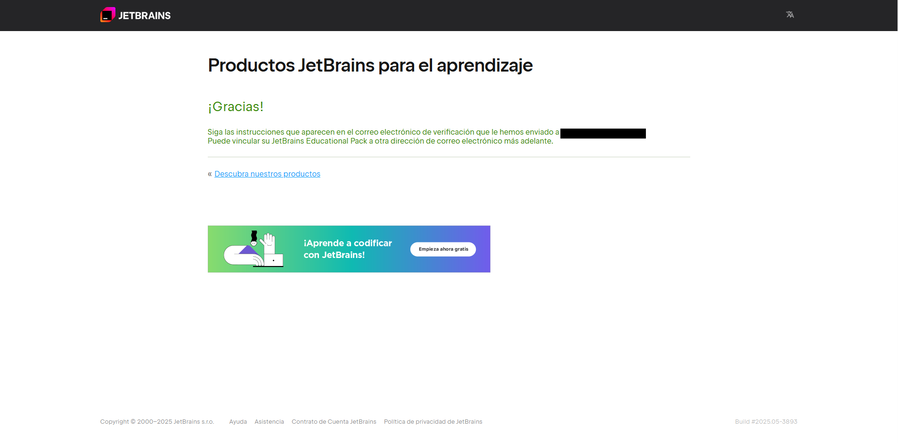

16. Abre el correo que recibiste de JetBrains en tu correo institucional.

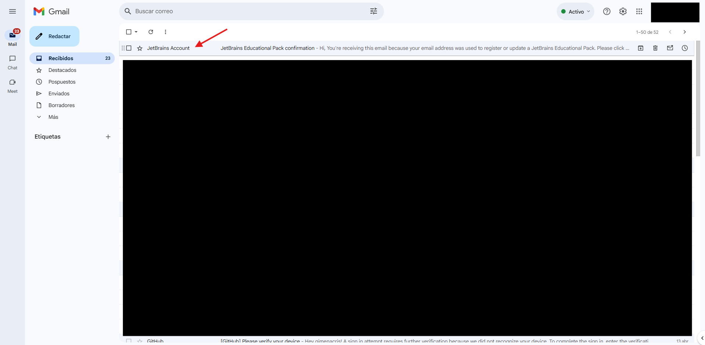

17. Haz clic en el enlace contenido en el correo.

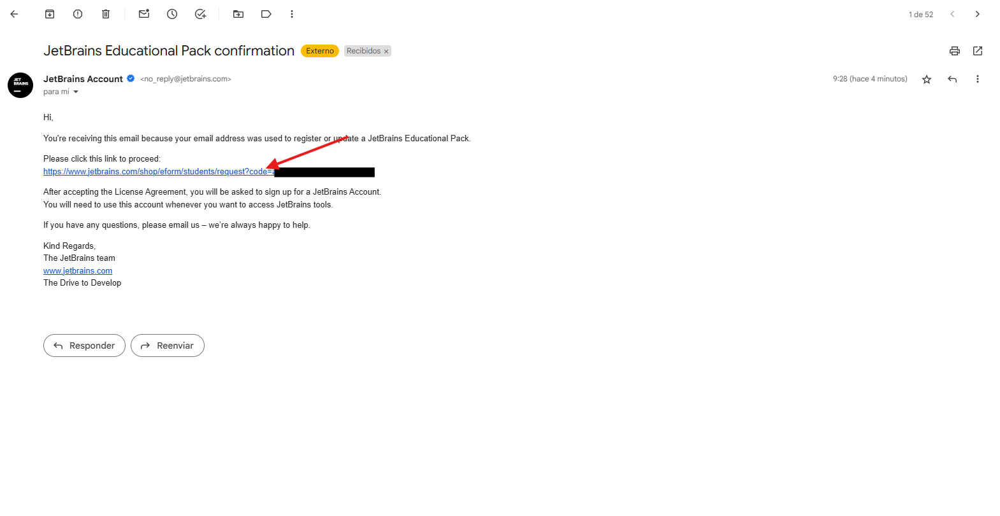

18. Haz clic en el botón **Get Started to Use**.

19. Confirma nuevamente que eres humano.

20. Serás redirigido a los términos y condiciones. Desplázate hacia abajo.

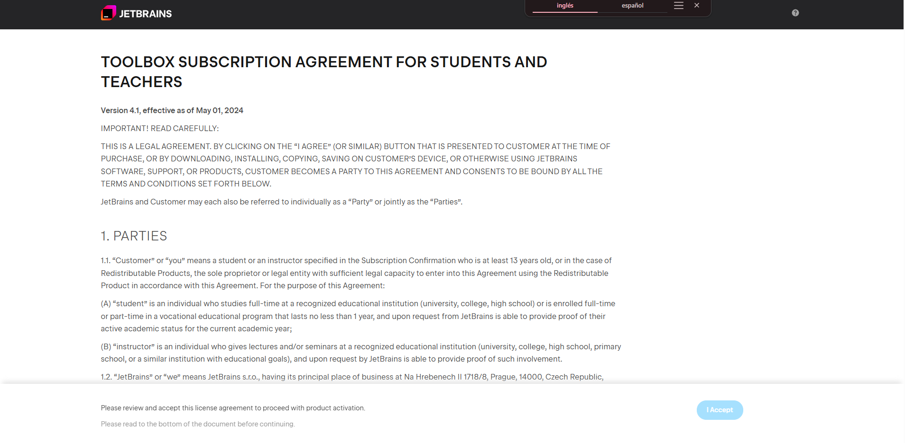

21. Haz clic en **I Accept** para aceptar los términos.

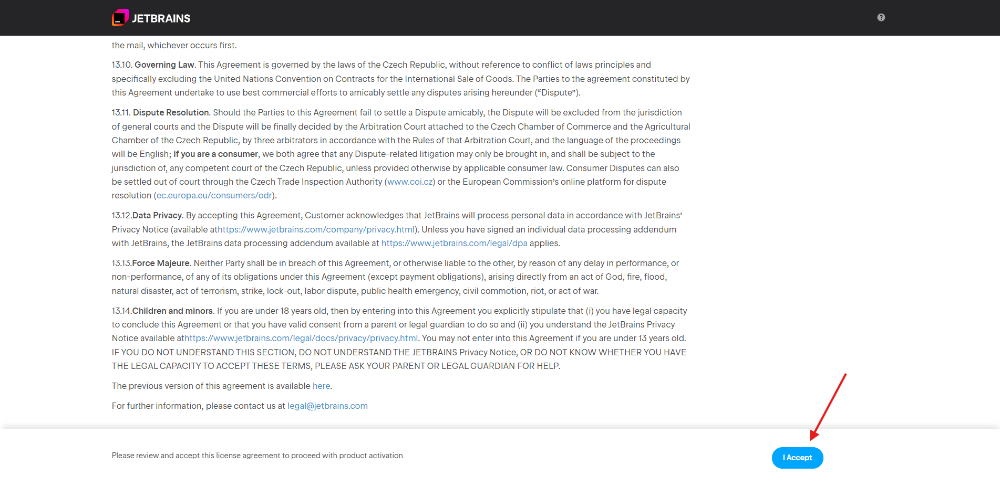

22. Accede con tu cuenta de GitHub, ya que la usaste para registrarte.

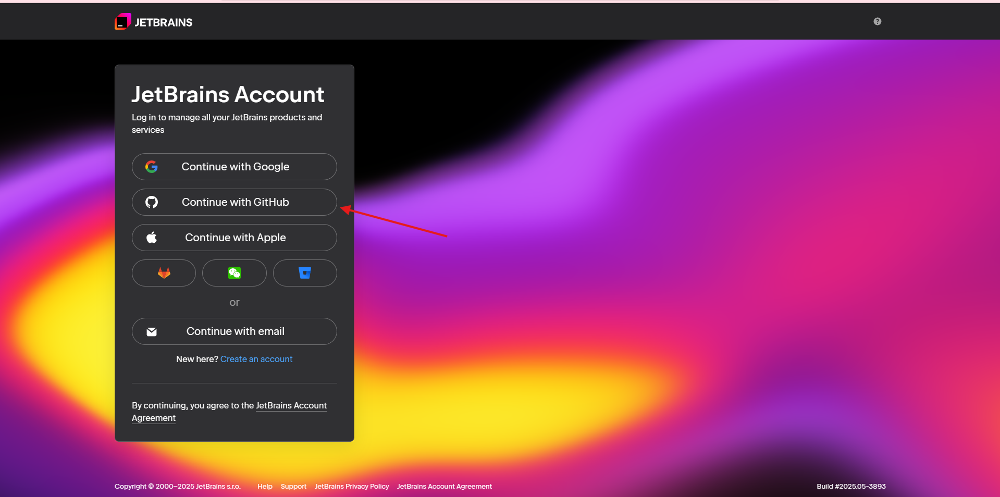

23. Autoriza el acceso a través de GitHub.

24. Revisa tu correo para obtener el código de inicio de sesión y escríbelo donde corresponde.

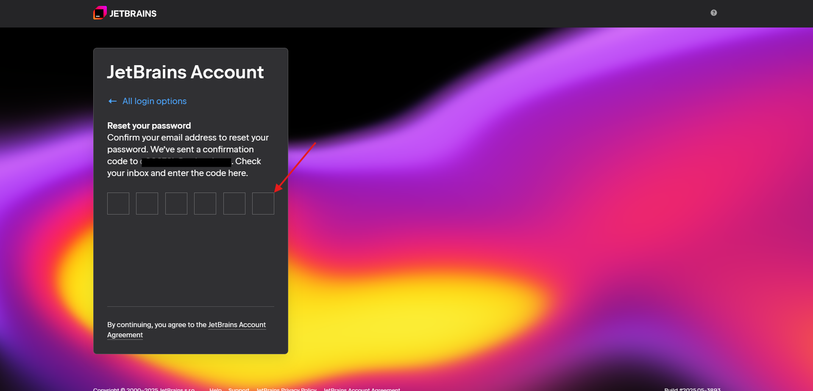

25. Finalmente, verás la información de tu licencia y podrás descargar cualquier herramienta de JetBrains.

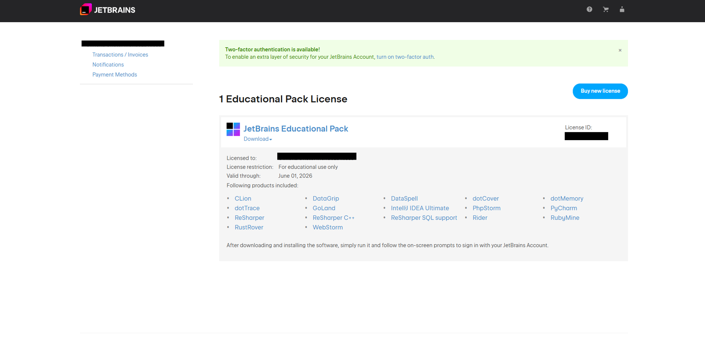

---

## ✅ Recomendaciones

- Usa siempre tu **correo institucional** para GitHub y JetBrains.
- No compartas tu licencia: es personal y de uso exclusivamente educativo.
- La licencia tiene una duración de 1 año y se puede renovar mientras mantengas tu condición de estudiante.

---

## 📂 Archivos sugeridos en esta carpeta

- `Captura-GitHub-Pack.png` → Imagen del beneficio JetBrains en el Student Pack.
- `Captura-Licencia-JetBrains.png` → Vista del panel con licencia activa.
- `Guía-Renovación.pdf` → Instrucciones para renovar la licencia una vez vencida.

---

## 🎉 ¡Ya puedes trabajar como un profesional!

Ahora puedes utilizar herramientas de desarrollo de clase mundial sin costo.  
Aprovecha al máximo esta oportunidad para crear, practicar y destacar en tus proyectos. 🚀