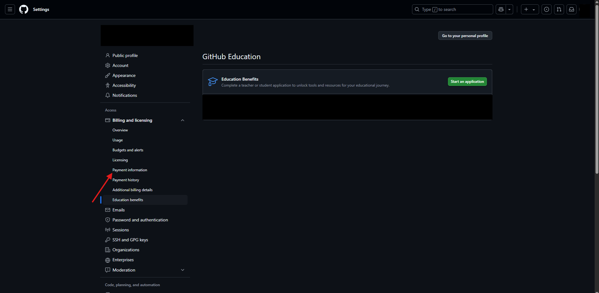
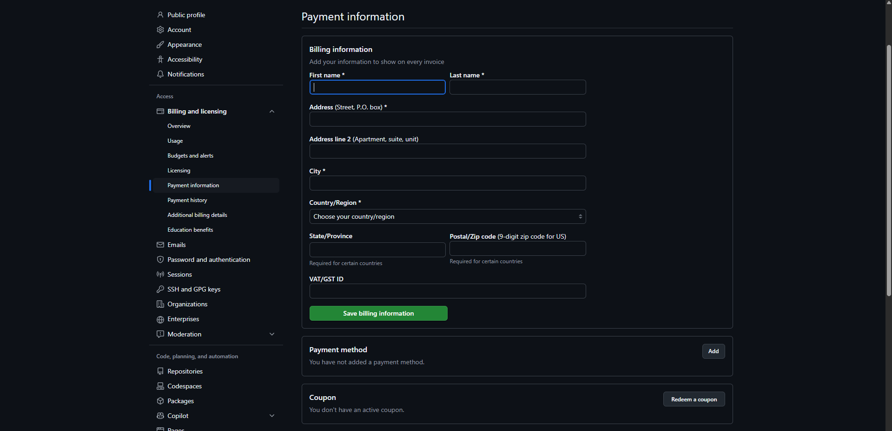

# 🎓 Guía para Obtener GitHub Education Pack

El **GitHub Student Developer Pack** es una iniciativa que ofrece GitHub para apoyar a estudiantes de todo el mundo. Al obtenerlo, accedes a **más de 100 herramientas premium totalmente gratis** durante el tiempo que seas estudiante.

---

## 🧠 ¿Por qué obtener GitHub Education?

Al obtener este beneficio como estudiante, podrás:

- Usar **GitHub Pro** sin pagar.
- Obtener un **dominio gratuito** (.me) gracias a Namecheap.
- Acceder a las **IDEs profesionales de JetBrains** como IntelliJ IDEA, WebStorm, PhpStorm, etc.
- Usar **Canva Pro** para tus diseños sin limitaciones.
- Recibir créditos gratis para **servicios en la nube** como DigitalOcean, MongoDB Atlas, Replit, entre otros.
- Profesionalizar tus proyectos personales y académicos con herramientas de primer nivel.

---

## 📧 Usa tu cuenta institucional

Para ser aprobado más rápido y sin rechazos, se recomienda **crear tu cuenta de GitHub usando tu correo institucional** (ejemplo: `codigo@ms.upla.edu.pe` o `codigo@upla.edu.pe`).

> También puedes usar una cuenta personal de GitHub y luego verificarla como estudiante, pero con el correo institucional el proceso es más directo y confiable.

---

## 🛠️ Pasos para obtener GitHub Education

A continuación te presento los pasos para solicitar tu beneficio de estudiante:

---

### 1️⃣ Crear cuenta en GitHub

- Ve a [https://github.com/](https://github.com/) 🌐 *(usa Ctrl + clic para abrir en nueva pestaña)*

- Ingresa a **Sign Up**, que es para registrarte.

- Rellena el formulario usando tu **correo institucional** e indica el **país** donde se ubica tu universidad.

- Selecciona **Rompecabezas visual** para verificar tu cuenta.

- Sigue los pasos que te indica GitHub para la verificación.

- Te llegará un **código** a tu correo; ingrésalo en el formulario para completar el registro.

- Una vez validado el código, tu cuenta habrá sido creada correctamente. Luego, inicia sesión ingresando tu correo y contraseña.

### 2️⃣ Solicitar GitHub Education Pack

- Abre el siguiente enlace: 👉 [https://github.com/education](https://github.com/education) 🌐*(usa Ctrl + clic para abrir en nueva pestaña)*

- Ingresa a **Join Github Education**

- Nos llevara a un apartado de github education

- Nos Dirigimos a **Payment information**

- Rellenamos el formulario de pago y le damos a **Save billing information** (esto se hace para que github tenga nuestros datos reales y no crea que somos bots, sino rellenas este formulario cuando solicites te pedira ingresarlo, no ingresen **Payment Method**)

- Ya rellenado nos dirigimos de nuevo a **Education benefit**

- Nos dirigimos a **Start an application**

- Seleccionamos nuestro rol dentro de la institucion, **estudiante** o **docente**, y le damos a **select this school** (esta opcion saldra siempre y cuandoo te registraste ccon tu correo institucional sino tendras que buscar la institucion)

- le damos a **Share Location** eso hara que github pueda validar nuestra ubicacion con la de la institucion, luego vuelves a darle a **continue**

- 