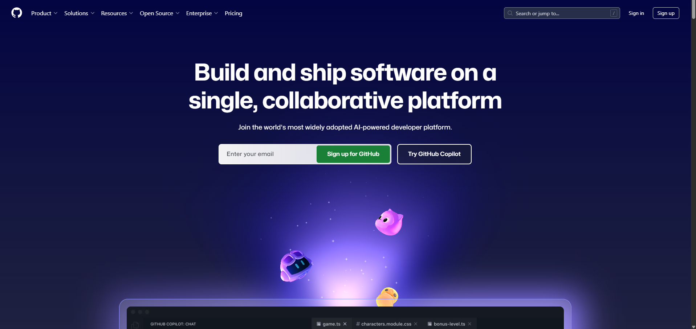
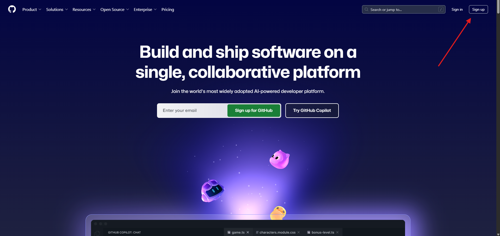
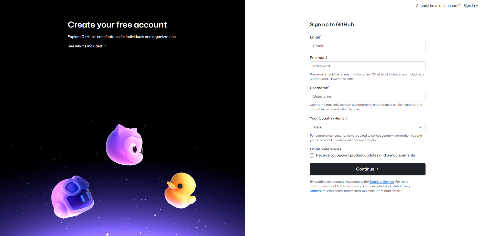

# 🎓 Guía para Obtener GitHub Education Pack

El **GitHub Student Developer Pack** es una iniciativa que ofrece GitHub para apoyar a estudiantes de todo el mundo. Al obtenerlo, accedes a **más de 100 herramientas premium totalmente gratis** durante el tiempo que seas estudiante.

---

## 🧠 ¿Por qué obtener GitHub Education?

Al obtener este beneficio como estudiante, podrás:

- Usar **GitHub Pro** sin pagar.
- Obtener un **dominio gratuito** (.me) gracias a Namecheap.
- Acceder a las **IDEs profesionales de JetBrains** como IntelliJ IDEA, WebStorm, PhpStorm, etc.
- Usar **Canva Pro** para tus diseños sin limitaciones.
- Recibir créditos gratis para **servicios en la nube** como DigitalOcean, MongoDB Atlas, Replit, entre otros.
- Profesionalizar tus proyectos personales y académicos con herramientas de primer nivel.

---

## 📧 Usa tu cuenta institucional

Para ser aprobado más rápido y sin rechazos, se recomienda **crear tu cuenta de GitHub usando tu correo institucional** (ejemplo: `codigo@ms.upla.edu.pe` o `codigo@upla.edu.pe`).

> También puedes usar una cuenta personal de GitHub y luego verificarla como estudiante, pero con el correo institucional el proceso es más directo y confiable.

---

## 🛠️ Pasos para obtener GitHub Education

A continuación te presento los pasos para solicitar tu beneficio de estudiante. Puedes acompañar cada paso con las imágenes de ejemplo que tú mismo subirás a esta carpeta:

---

### 1️⃣ Crear cuenta en GitHub

- Ve a [https://github.com/](https://github.com/)

- Ingresa a **Sign Up** que es para registrarte

- Rellena el formulario usando tu **correo institucional** e ingresa el **país** donde se ubica tu universidad.

- Elige un nombre de usuario profesional y seguro.
- Confirma tu correo desde tu bandeja de entrada.

